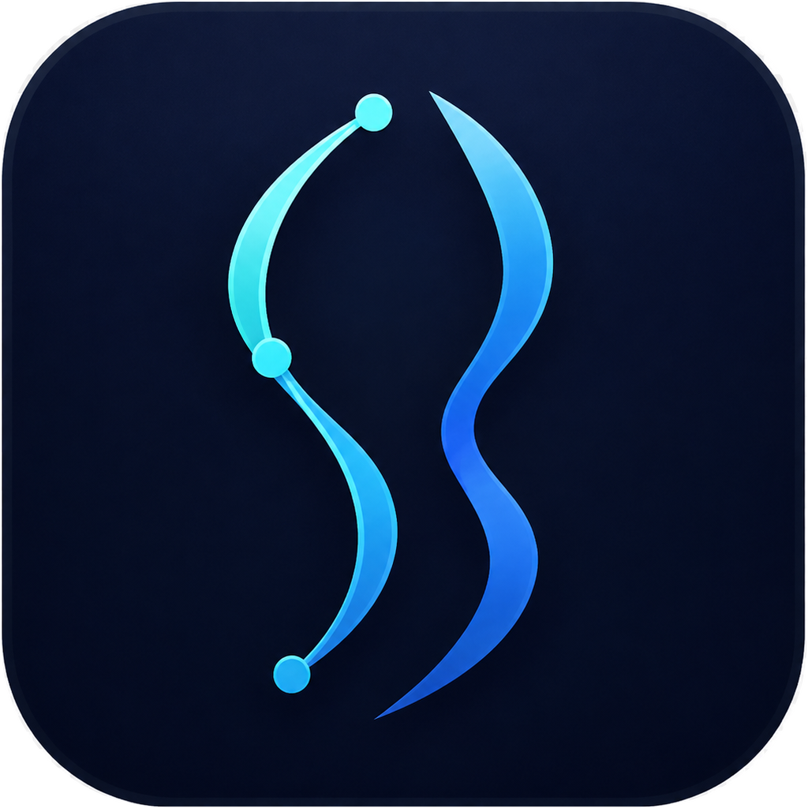
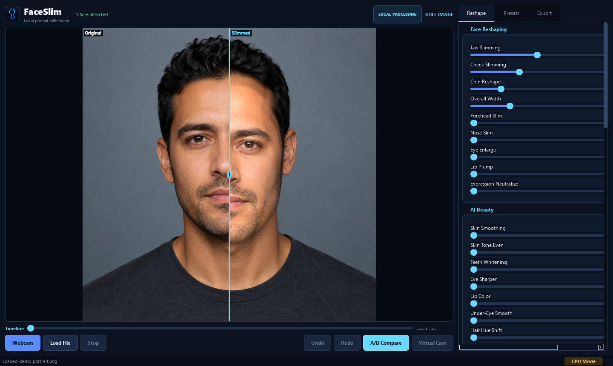
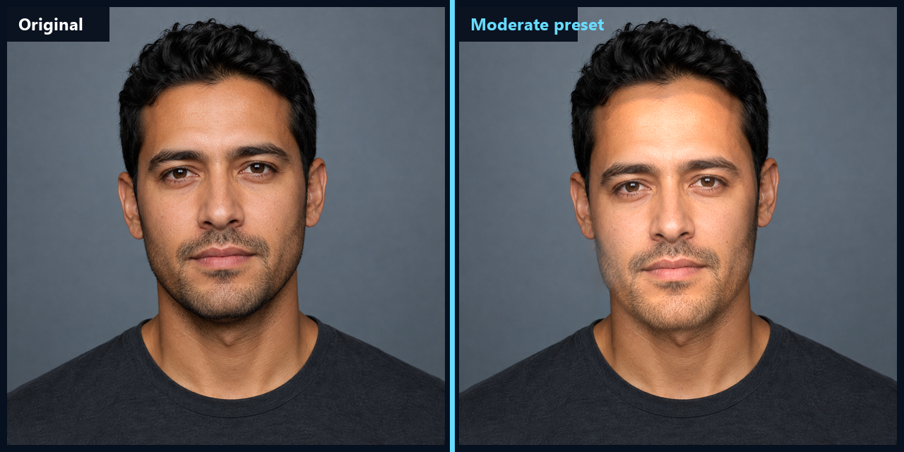
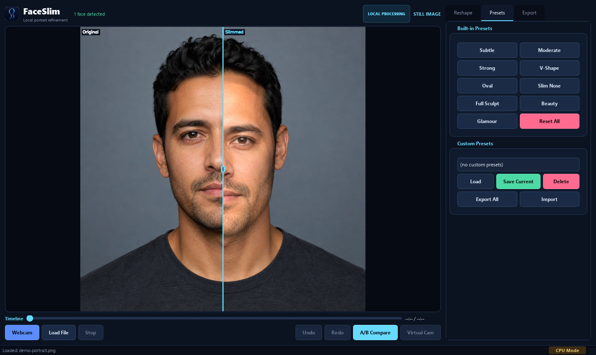
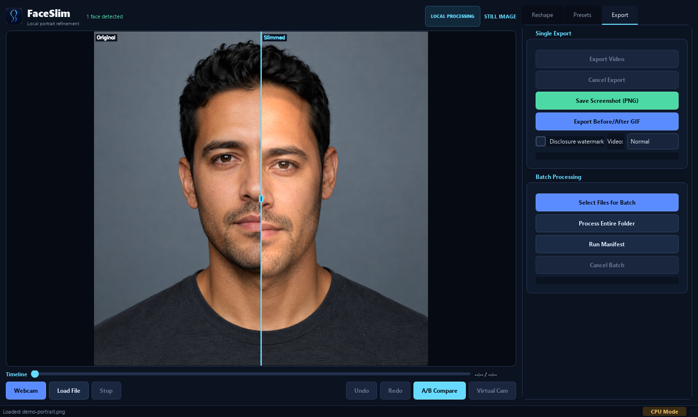

<p align="center">
  
</p>

<h1 align="center">FaceSlim</h1>

<p align="center">
  Local-first portrait reshaping for images, video, webcam, and repeatable batch work.
</p>

<p align="center">
  
  
  
  
</p>

<p align="center">
  <a href="#run-from-source"><strong>Run FaceSlim</strong></a>
  &nbsp;•&nbsp;
  <a href="https://github.com/SysAdminDoc/FaceSlim/releases"><strong>Release notes</strong></a>
  &nbsp;•&nbsp;
  <a href="#command-line"><strong>Use the CLI</strong></a>
</p>



FaceSlim gives photographers, creators, and automation-heavy workflows direct control over portrait geometry. Adjust the jaw, cheeks, chin, eyes, nose, and more while a draggable comparison shows the change. Media stays on your machine. The same controls work across the desktop interface and command line.

## Why FaceSlim

| Shape with control | Keep media local |
|---|---|
| Tune individual features with measured sliders, saved presets, per-face overrides, and undo history. | Images and video are processed locally. Network access is used only when a required model needs to be downloaded. |
| **Preview before export** | **Move beyond one portrait** |
| Inspect a draggable A/B view, optional landmarks, confidence, and the exact teeth-whitening mask. | Work with folders, JSON manifests, video, webcam preview, or an OBS-compatible virtual camera. |

FaceSlim uses MediaPipe landmarks for geometry and optional BiSeNet masks for targeted finishing. Background protection keeps the warp near the face instead of bending the whole frame.

## Real result



The comparison above is an actual CPU run using the built-in Moderate preset on a fictional demo portrait. No manual retouching was added after export.

## Interface

<table>
  <tr>
    <td width="50%"></td>
    <td width="50%"></td>
  </tr>
  <tr>
    <td><sub>Start with nine built-in looks or save your own.</sub></td>
    <td><sub>Export a still, comparison GIF, video, folder, or manifest.</sub></td>
  </tr>
</table>

## Get started

### Windows app

Use the [source setup below](#run-from-source) for v1.29.1. The portable executable was rebuilt and tested locally, but a new binary download is on hold while the bundled PyQt5 and pyvirtualcam license combination is clarified. See [third-party notices](THIRD_PARTY_NOTICES.md). The source setup uses the updated dependencies and current branding.

Older Windows executables are not code-signed. SmartScreen may warn when they are downloaded. Their checksums verify file integrity, not dependency currency or signing. They do not include the v1.29.1 dependency updates.

On the first edit, FaceSlim downloads the MediaPipe face landmarker and selected parsing model. Later launches use the verified local cache.

### Run from source

Windows:

```powershell
git clone https://github.com/SysAdminDoc/FaceSlim.git
cd FaceSlim
python tools/bootstrap_dev.py
.venv\Scripts\python FaceSlim_v1.py
```

macOS or Linux:

```bash
git clone https://github.com/SysAdminDoc/FaceSlim.git
cd FaceSlim
python3 -m venv .venv
. .venv/bin/activate
python -m pip install -r requirements.txt
python FaceSlim_v1.py
```

Python 3.10 or newer is required. Python 3.11 is the tested release host. See [Compatibility](#compatibility) before moving a production setup to a newer interpreter.

## Controls

### Geometry

| Control | What it changes |
|---|---|
| Jaw Slimming | Pulls the jaw contour inward |
| Cheek Slimming | Reduces width through the cheek area |
| Chin Reshape | Narrows and lifts the chin |
| Overall Width | Adjusts the full lower-face width |
| Forehead Slim | Narrows the upper face |
| Nose Slim | Refines the bridge and tip width |
| Eye Enlarge | Expands the eye contour from the iris center |
| Lip Plump | Expands the upper and lower lip contour |
| Expression Neutralize | Softens frown and brow movement using blendshape guidance |

### Targeted finishing

| Control | What it changes |
|---|---|
| Skin Smoothing | Softens skin while retaining visible texture |
| Skin Tone Even | Reduces local redness and color variation |
| Teeth Whitening | Changes only the parsed mouth interior |
| Eye Sharpen | Adds local detail around eyes and brows |
| Lip Color | Adjusts lip saturation and warmth |
| Under-Eye Smooth | Treats the area beneath each eye separately |
| Hair and makeup controls | Adjust hue, saturation, density, blush, gloss, and eye shadow |
| Restore and upscale | Optionally runs GFPGAN, Real-ESRGAN 2x, or both after the main pass |

## Presets

Nine built-in presets cover light adjustments through combined reshaping and finishing:

| Preset | Focus |
|---|---|
| Subtle | Light jaw and cheek adjustment |
| Moderate | Balanced face shaping |
| Strong | More pronounced jaw, cheek, chin, and width changes |
| V-Shape | Jaw-focused contouring |
| Oval | Softer overall face shape |
| Slim Nose | Nose-only adjustment |
| Full Sculpt | Combined geometry controls |
| Beauty | Finishing controls without geometry changes |
| Glamour | Geometry and finishing in one preset |

Custom presets are stored under `%APPDATA%\.faceslim\presets\` on Windows and `~/.faceslim/presets/` on macOS and Linux. They can be exported, imported, and shared as JSON.

## Command line

The CLI uses the same processing path as the desktop app.

```bash
# Process one portrait
python FaceSlim_v1.py --input photo.jpg --preset Moderate

# Process a folder
python FaceSlim_v1.py --input ./portraits --output ./results --preset Subtle

# Use different settings for faces in a group photo
python FaceSlim_v1.py --input group.jpg --faces 3 \
  --face-preset 1=Subtle --face-param 2:jaw=45

# Export a split comparison with a disclosure watermark
python FaceSlim_v1.py --input clip.mp4 --preset Glamour \
  --video-compare split --watermark

# Choose a parser and ONNX provider
python FaceSlim_v1.py --input photo.jpg --parser-model bisenet_resnet34 \
  --onnx-provider cpu --skin-smooth 35

# Inspect models and provider status
python FaceSlim_v1.py --list-models --onnx-provider cpu
python FaceSlim_v1.py --provider-diagnostics --onnx-provider auto
```

Run `python FaceSlim_v1.py --help` for the full argument list. Batch manifests support per-file presets, output paths, face limits, disclosure settings, and per-face overrides.

## Processing and privacy

- Portraits, frames, manifests, and presets remain local.
- Downloaded models are checked against an exact byte size and SHA-256 hash before use.
- Image exports keep source metadata by default and add edit provenance. `--strip-metadata` removes source metadata while keeping FaceSlim provenance.
- Video and batch work runs a preflight that checks media details, free space, output access, and codec availability.
- CPU works without extra setup. CUDA and DirectML can be selected when the matching local runtime is available.

FaceSlim can add an optional visible disclosure watermark. Exported images also record the IPTC DigitalSourceType value for algorithmically enhanced media.

## Models

| Model | Download | License | Used for |
|---|---:|---|---|
| MediaPipe Face Landmarker | 3.7 MB | Apache-2.0 | Landmarks and blendshapes |
| BiSeNet ResNet18 | 53 MB | MIT | Fast face-region masks |
| BiSeNet ResNet34 | 94 MB | MIT | Higher-detail face-region masks |
| MODNet | 26 MB | Apache-2.0 | Optional matte refinement |
| GFPGAN 1.4 | 340 MB | Apache-2.0 | Optional face restoration |
| Real-ESRGAN 2x | 70 MB | BSD-3-Clause | Optional 2x upscale |

The landmarker and selected BiSeNet model download on first use. MODNet, GFPGAN, and Real-ESRGAN download only when their related feature is enabled. If face parsing is unavailable, geometry controls still work with landmark-based masking.

## Supported media

| Type | Formats |
|---|---|
| Images | JPG, JPEG, PNG, BMP, TIFF, TIF, WebP |
| Video | MP4, AVI, MOV, MKV, WebM, WMV, FLV, M4V |

FFmpeg is optional. Install it when exported video should retain audio. An OBS-compatible virtual camera driver is required for virtual-camera output.

## Compatibility

| Python | Status |
|---|---|
| 3.9 and earlier | Unsupported. The patched Pillow dependency requires Python 3.10 or newer. |
| 3.10 | Minimum source runtime. Use Python 3.11 for the verified release setup. |
| 3.11 | Tested runtime and Windows release host. |
| 3.12 | Upgrade lane. Dependency imports and resolution are checked locally. |
| 3.13 | Watch status. Do not use for release builds yet. |
| 3.14 | Experimental. Package and ABI coverage is still changing. |

ONNX Runtime 1.27.0 currently fails the Python 3.12 import smoke on the release machine, so runtime pins remain conservative.

## Brand assets

The asymmetric profile contour is the approved FaceSlim identity. The [untouched selected master](assets/brand/faceslim-selected-master.png) sits beside the production icon. The [concept archive](assets/brand/concepts/) preserves every reviewed direction plus the fictional demo portrait used for product evidence, and [selection.json](assets/brand/concepts/selection.json) records the exact approved files.

## Build and test

```powershell
.venv\Scripts\python -m compileall -q FaceSlim.py FaceSlim_v1.py runtime_hook_mp.py faceslim
.venv\Scripts\python -m unittest discover -s tests
.venv\Scripts\pyinstaller.exe FaceSlim.spec --noconfirm --clean
```

The Windows executable is written to `dist\FaceSlim.exe`. The PyInstaller entry point and runtime hook both enable multiprocessing freeze support before model libraries load. The spec includes MediaPipe's dynamically loaded task library. Building locally does not clear the [binary redistribution hold](THIRD_PARTY_NOTICES.md#windows-binary-status).

## Responsible use

Edit media you own or have permission to change. Do not use FaceSlim to misrepresent identity or consent. Disclose material appearance changes when the context, platform, or local law calls for it.

## Troubleshooting

### A model will not download

Open the model inventory in the desktop app or run `--list-models`. A corrupt cache is removed automatically and can be fetched again with `--redownload-model <key>`.

### Preview is slow

Set Preview Scale to 75% or 50%. CUDA can accelerate the TPS warp when PyTorch is installed with compatible GPU support.

### A strong warp touches the background

Raise Background Protection. Add Matting Refine when hair and face boundaries need a tighter blend.

### Video has no audio

Install FFmpeg and make sure it is available on `PATH`. FaceSlim keeps the rendered video and reports the mux problem in `render.log` if audio copying fails.

Crash details are written to `crash.log`. Export and processing diagnostics are written as JSON lines to `render.log`.

## License

FaceSlim's own source is released under the [MIT License](LICENSE). Dependencies retain their own terms. PyQt5 uses GPLv3, and pyvirtualcam declares GPLv2, so the MIT badge does not describe a combined Windows executable. Read the [third-party notices and binary-release status](THIRD_PARTY_NOTICES.md) before redistributing a packaged build. Issues and pull requests are welcome.
